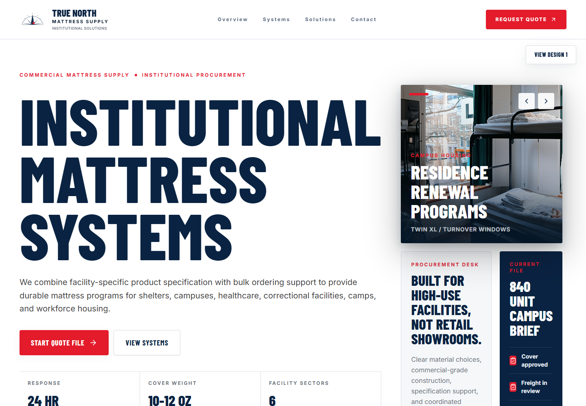
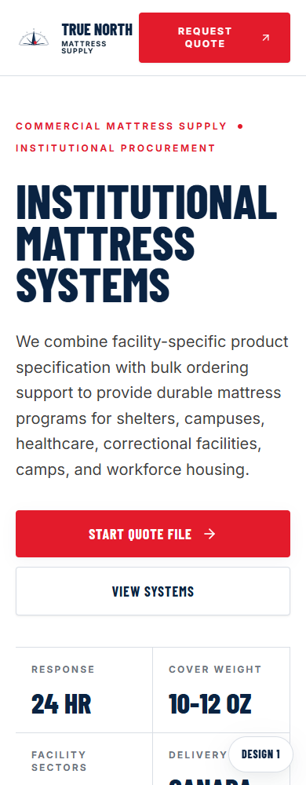

# True North Mattress Supply

Premium homepage concepts for a Canadian institutional mattress supplier serving shelters, campuses, healthcare facilities, correctional facilities, camps, and workforce housing.

The current build is focused on client presentation: two distinct homepage directions, same brand system, same commercial procurement story.

## Preview

### Homepage Concept 01

A bold industrial procurement direction with an immersive hero, sector pathways, product logic, compliance messaging, and operational credibility.


<p align="center">
  
</p>

### Homepage Concept 02

A cleaner corporate-services direction inspired by premium capital/advisory websites: large editorial typography, metrics, image slider, product program table, procurement cards, and support solution blocks.



<p align="center">
  
</p>

## Demo Routes

```text
Homepage Concept 01  /#/
Homepage Concept 02  /#/home-design-2
```

The presentation build is intentionally homepage-only. Navigation elements are kept for realism, but the demo experience is locked to the two homepage concepts.

## Built With

- React
- TypeScript
- Vite
- Tailwind CSS
- Motion
- Lucide icons

## Local Setup

```bash
npm install
npm run dev
```

The local server runs on:

```text
http://localhost:3000
```

## Quality Checks

```bash
npm run lint
npm run build
```

## Project Notes

- Brand palette follows the True North identity: deep navy, red, white, and cool institutional surface tones.
- Both homepage concepts are responsive and checked at mobile and desktop widths.
- Image assets are stored in `public/images`.
- README preview screenshots are stored in `docs/screenshots`.
