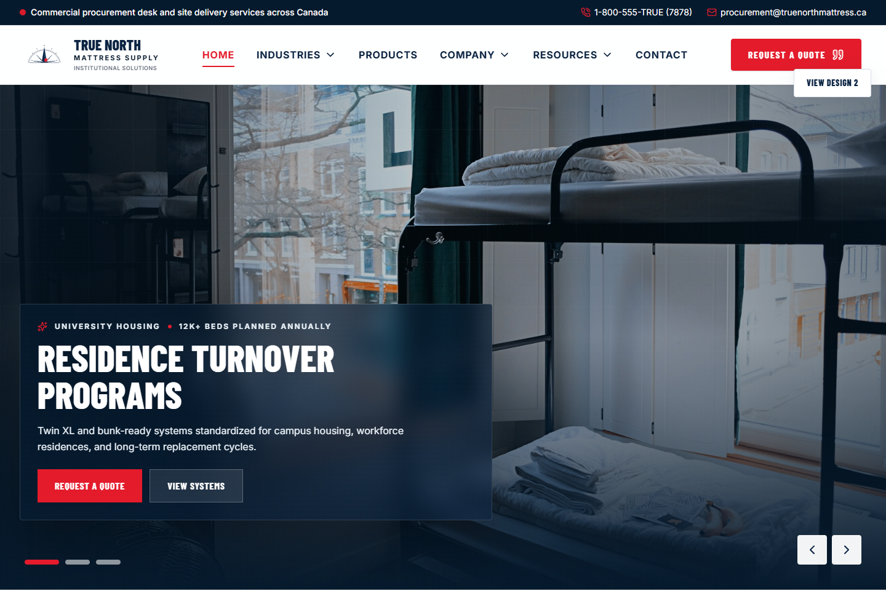
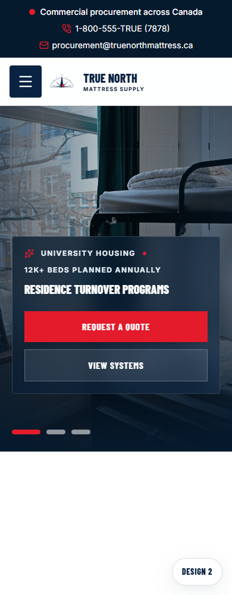

# True North Mattress Supply

Premium website for a Canadian institutional mattress supplier serving shelters, campuses, healthcare facilities, correctional facilities, camps, and workforce housing.

The current build uses a single bold industrial procurement direction with an immersive hero, sector pathways, product logic, compliance messaging, and operational credibility.

## Preview

### Homepage



<p align="center">
  
</p>

## Routes

```text
Homepage  /#/
```

## Built With

- React
- TypeScript
- Vite
- Tailwind CSS
- Motion
- Lucide icons

## Local Setup

```bash
npm install
npm run dev
```

The local server runs on:

```text
http://localhost:3000
```

## Quality Checks

```bash
npm run lint
npm run build
```

## Project Notes

- Brand palette follows the True North identity: deep navy, red, white, and cool institutional surface tones.
- The homepage is responsive and checked at mobile and desktop widths.
- Image assets are stored in `public/images`.
- README preview screenshots are stored in `docs/screenshots`.
